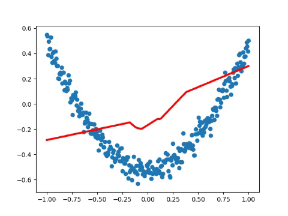

# Practice 6 - Visualize

This practice is refer to [莫烦PYTHON - TensorFlow: 例子3 结果可视化](https://morvanzhou.github.io/tutorials/machine-learning/tensorflow/3-3-visualize-result/). Credits to [Morvan](https://github.com/MorvanZhou).

---
## Execution

1. Run `main.py`
    ```bash
    # Make sure your current directory is in this folder
    $ python3 main.py
    ```
2. If succeed, you will get the following result (the result is not unique)
    

---
## References

* [TensorFlow Official - Tutorial](https://www.tensorflow.org/tutorials/)
* [GitHub - tensorFlow/tensorflow](https://github.com/tensorflow/tensorflow)
* [莫烦PYTHON - TensorFlow](https://morvanzhou.github.io/tutorials/machine-learning/tensorflow)

---
## Contributor

* [Morvan](https://github.com/MorvanZhou)
* [David Lu](https://github.com/yungshenglu)