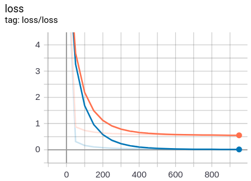
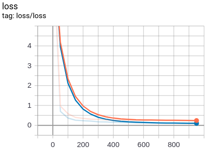

# Practice 10 - Solving Overfitting via Dropout

This practice is refer to [莫烦PYTHON - TensorFlow: 什么是过拟合 (Overfitting)](https://morvanzhou.github.io/tutorials/machine-learning/tensorflow/5-02-A-overfitting/) and [Dropout 解决 overfitting](https://morvanzhou.github.io/tutorials/machine-learning/tensorflow/5-02-dropout/). Credits to [Morvan](https://github.com/MorvanZhou).

---
## Execution

> **NOTICE:** The files for TensorBoard running by myself are stored in the folder `out/`

### Before Dropout

1. Run `main1.py`
    ```bash
    # Make sure your current directory is in this folder
    $ python3 main1.py
    ```
2. If succeed, you can check whether the files is generated in `logs/test/` and `logs/train/`
    ```bash
    # Make sure your current directory is in this folder
    $ ls ./logs/test/
    events.out.tfevents.1553934676.yungshenglu
    $ ls ./logs/train
    events.out.tfevents.1553934676.yungshenglu
    # The above filename is for example and won't be same with yours!
    ```
3. Run the log with TensorBoard
    ```bash
    $ tensorboard --logdir='./logs/'
    TensorBoard 1.13.0 at http://yungshenglu:6006 (Press CTRL+C to quit)
    # The above link is just an example. Please use your link!
    ```
4. Open the browser and navigate to the website show in your terminal (`http://0.0.0.0:6006`) (the result is not unique)
    

### After Dropout

1. Remove the folder `logs/test` and `logs/train` to avoid the overlapping on TensorBoard
    ```bash
    # Make sure your current directory is in this folder
    $ rm -rf ./logs/test/ ./logs/train/
    ```
2. Run `main2.py`
    ```bash
    # Make sure your current directory is in this folder
    $ python3 main2.py
    ```
3. If succeed, you can check whether the files is generated in `logs/test/` and `logs/train/`
    ```bash
    # Make sure your current directory is in this folder
    $ ls ./logs/test/
    events.out.tfevents.1553934804.yungshenglu
    $ ls ./logs/train
    events.out.tfevents.1553934804.yungshenglu
    # The above filename is for example and won't be same with yours!
    ```
4. Run the log with TensorBoard
    ```bash
    $ tensorboard --logdir='./logs/'
    TensorBoard 1.13.0 at http://yungshenglu:6006 (Press CTRL+C to quit)
    # The above link is just an example. Please use your link!
    ```
5. Open the browser and navigate to the website show in your terminal (`http://0.0.0.0:6006`) (the result is not unique)
    

---
## References

* [TensorFlow Official - Tutorial](https://www.tensorflow.org/tutorials/)
* [GitHub - tensorFlow/tensorflow](https://github.com/tensorflow/tensorflow)
* [莫烦PYTHON - TensorFlow](https://morvanzhou.github.io/tutorials/machine-learning/tensorflow)