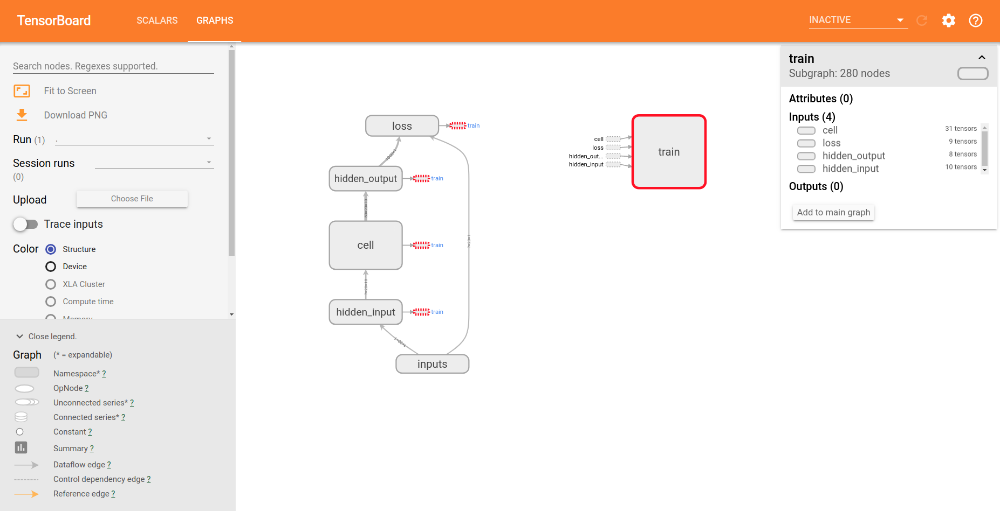

# Practice 12 - RNN in TensroFlow

This practice is refer to the following resources credited to [Morvan](https://github.com/MorvanZhou).
* [莫烦PYTHON - TensorFlow: 什么是循环神经网络 RNN (Recurrent Neural Network)](https://morvanzhou.github.io/tutorials/machine-learning/tensorflow/5-07-A-RNN/)
* [莫烦PYTHON - TensorFlow: 什么是 LSTM 循环神经网络](https://morvanzhou.github.io/tutorials/machine-learning/tensorflow/5-07-B-LSTM//)
* [莫烦PYTHON - TensorFlow: RNN 循环神经网络](https://morvanzhou.github.io/tutorials/machine-learning/tensorflow/5-07-RNN1/)
* [莫烦PYTHON - TensorFlow: RNN LSTM 循环神经网络 (分类例子)](https://morvanzhou.github.io/tutorials/machine-learning/tensorflow/5-08-RNN2/)
* [莫烦PYTHON - TensorFlow: RNN LSTM (回归例子)](https://morvanzhou.github.io/tutorials/machine-learning/tensorflow/5-09-RNN3/)
* [莫烦PYTHON - TensorFlow: RNN LSTM (回归例子可视化)](https://morvanzhou.github.io/tutorials/machine-learning/tensorflow/5-10-RNN4/)

For more detail about RNN and LSTM, you can watch the following video on YouTube.
* [Recurrent Neural Network (RNN)](http://img.youtube.com/vi/H3ciJF2eCJI/0.jpg)

    [](https://www.youtube.com/watch?v=H3ciJF2eCJI)

* [Long-Short Term Memory (LSTM)](http://img.youtube.com/vi/V3D5ovKE9Og/0.jpg)

    [](https://www.youtube.com/watch?v=V3D5ovKE9Og)

---
## Execution

### Example 1: Classification

1. Run `main1.py`
    ```bash
    # Make sure your current directory is in this folder
    $ python3 main1.py
    ```
2. If succeed, you will get the following result (take few minutes)
    ```bash
    # If you run the program first time, you may download the datasets first (optional)
    Downloading data from https://s3.amazonaws.com/img-datasets/mnist.npz
    11493376/11490434 [==============================] - 12s 1us/step
    
    # If you have already run the pregram before, you may see the following information (optional)
    Extracting MNIST_data/train-images-idx3-ubyte.gz
    Extracting MNIST_data/train-labels-idx1-ubyte.gz
    Extracting MNIST_data/t10k-images-idx3-ubyte.gz
    Extracting MNIST_data/t10k-labels-idx1-ubyte.gz

    # The probability of prediction (the result is not unique)
    Step   0: 0.109375
    Step  50: 0.734375
    Step 100: 0.84375
    Step 150: 0.9140625
    Step 200: 0.921875
    Step 250: 0.8984375
    Step 300: 0.921875
    Step 350: 0.96875
    Step 400: 0.96875
    Step 450: 0.953125
    Step 500: 0.96875
    Step 550: 0.9296875
    Step 600: 0.96875
    Step 650: 0.9453125
    Step 700: 0.96875
    Step 750: 0.9609375
    ```

### Example 2: Regresssion 

> **NOTICE:** For this example, you can refer to this [material](https://r2rt.com/styles-of-truncated-backpropagation.html)

1. Run `main2.py`
    ```bash
    # Make sure your current directory is in this folder
    $ python3 main2.py
    ```
2. If succeed, you will get the following result (take few minutes)
    ```bash
    # If you run the program first time, you may download the datasets first (optional)
    Downloading data from https://s3.amazonaws.com/img-datasets/mnist.npz
    11493376/11490434 [==============================] - 12s 1us/step
    
    # If you have already run the pregram before, you may see the following information (optional)
    Extracting MNIST_data/train-images-idx3-ubyte.gz
    Extracting MNIST_data/train-labels-idx1-ubyte.gz
    Extracting MNIST_data/t10k-images-idx3-ubyte.gz
    Extracting MNIST_data/t10k-labels-idx1-ubyte.gz

    # The loss rate of prediction (the result is not unique)
    Step   0, Loss: 19.687599
    Step  20, Loss: 8.454300
    Step  40, Loss: 1.394400
    Step  60, Loss: 0.342600
    Step  80, Loss: 1.573500
    Step 100, Loss: 0.194600
    Step 120, Loss: 0.129400
    Step 140, Loss: 0.298300
    Step 160, Loss: 0.117500
    Step 180, Loss: 0.036900
    ```
3. You can check whether the files is generated in `logs/`
    ```bash
    # Make sure your current directory is in this folder
    $ ls ./logs/
    events.out.tfevents.1553934676.yungshenglu
    # The above filename is for example and won't be same with yours!
    ```
4. Run the log with TensorBoard
    ```bash
    $ tensorboard --logdir='./logs/'
    TensorBoard 1.13.0 at http://yungshenglu:6006 (Press CTRL+C to quit)
    # The above link is just an example. Please use your link!
    ```
5. Open the browser and navigate to the website show in your terminal (`http://0.0.0.0:6006`) (the result is not unique)
    
6. If succeed, you will get the following result (the result is not unique)
    

---
## References

* [TensorFlow Official - Tutorial](https://www.tensorflow.org/tutorials/)
* [GitHub - tensorFlow/tensorflow](https://github.com/tensorflow/tensorflow)
* [莫烦PYTHON - TensorFlow](https://morvanzhou.github.io/tutorials/machine-learning/tensorflow)