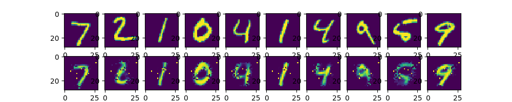
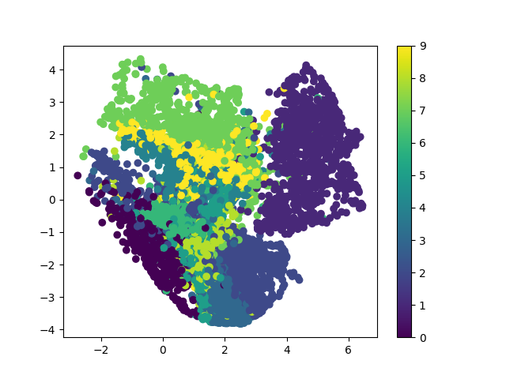

# Practice 13 - Autoencoder in TensroFlow

This practice is refer to the following resources credited to [Morvan](https://github.com/MorvanZhou).
* [莫烦PYTHON - TensorFlow: 什么是自编码 (Autoencoder)](https://morvanzhou.github.io/tutorials/machine-learning/tensorflow/5-11-A-autoencoder/)
* [莫烦PYTHON - TensorFlow: 自编码 Autoencoder (非监督学习)](https://morvanzhou.github.io/tutorials/machine-learning/tensorflow/5-11-autoencoder/)

---
## Execution

## Autoencoder

1. Run `main1.py`
    ```bash
    # Make sure your current directory is in this folder
    $ python3 main1.py
    ```
2. If succeed, you will get the following result (take few minutes)
    ```bash
    # If you run the program first time, you may download the datasets first (optional)
    Downloading data from https://s3.amazonaws.com/img-datasets/mnist.npz
    11493376/11490434 [==============================] - 12s 1us/step
    
    # If you have already run the pregram before, you may see the following information (optional)
    Extracting MNIST_data/train-images-idx3-ubyte.gz
    Extracting MNIST_data/train-labels-idx1-ubyte.gz
    Extracting MNIST_data/t10k-images-idx3-ubyte.gz
    Extracting MNIST_data/t10k-labels-idx1-ubyte.gz

    # The probability of prediction (the result is not unique)
    Epoch   1: Loss = 0.070371628
    Epoch   2: Loss = 0.061792824
    Epoch   3: Loss = 0.057367947
    Epoch   4: Loss = 0.055086661
    Epoch   5: Loss = 0.050911840
    Epoch   6: Loss = 0.049793467
    Epoch   7: Loss = 0.049022138
    Epoch   8: Loss = 0.047246918
    Epoch   9: Loss = 0.045892879
    Epoch  10: Loss = 0.045229465
    Epoch  11: Loss = 0.044753738
    Epoch  12: Loss = 0.041483913
    Epoch  13: Loss = 0.043634389
    Epoch  14: Loss = 0.042594045
    Epoch  15: Loss = 0.044084344
    Epoch  16: Loss = 0.042420749
    Epoch  17: Loss = 0.042780302
    Epoch  18: Loss = 0.042752471
    Epoch  19: Loss = 0.041828986
    Epoch  20: Loss = 0.040571641
    ```
3. You will get the following result (the result is not unique)
    

## Encoding

1. Run `main2.py`
    ```bash
    # Make sure your current directory is in this folder
    $ python3 main2.py
    ```
2. If succeed, you will get the following result (take few minutes)
    ```bash
    # If you run the program first time, you may download the datasets first (optional)
    Downloading data from https://s3.amazonaws.com/img-datasets/mnist.npz
    11493376/11490434 [==============================] - 12s 1us/step
    
    # If you have already run the pregram before, you may see the following information (optional)
    Extracting MNIST_data/train-images-idx3-ubyte.gz
    Extracting MNIST_data/train-labels-idx1-ubyte.gz
    Extracting MNIST_data/t10k-images-idx3-ubyte.gz
    Extracting MNIST_data/t10k-labels-idx1-ubyte.gz

    # The probability of prediction (the result is not unique)
    Epoch  1: Loss = 0.070924804
    Epoch  2: Loss = 0.059744425
    Epoch  3: Loss = 0.057972237
    Epoch  4: Loss = 0.049820133
    Epoch  5: Loss = 0.049503040
    Epoch  6: Loss = 0.048985694
    Epoch  7: Loss = 0.046035368
    Epoch  8: Loss = 0.045065016
    Epoch  9: Loss = 0.046500780
    Epoch 10: Loss = 0.041021083
    Epoch 11: Loss = 0.042688243
    Epoch 12: Loss = 0.042602878
    Epoch 13: Loss = 0.043667346
    Epoch 14: Loss = 0.042277016
    Epoch 15: Loss = 0.042719189
    Epoch 16: Loss = 0.040399708
    Epoch 17: Loss = 0.039351098
    Epoch 18: Loss = 0.039856773
    Epoch 19: Loss = 0.040220011
    Epoch 20: Loss = 0.040195532
    ```
3. You will get the following result (the result is not unique)
    

---
## References

* [TensorFlow Official - Tutorial](https://www.tensorflow.org/tutorials/)
* [GitHub - tensorFlow/tensorflow](https://github.com/tensorflow/tensorflow)
* [莫烦PYTHON - TensorFlow](https://morvanzhou.github.io/tutorials/machine-learning/tensorflow)