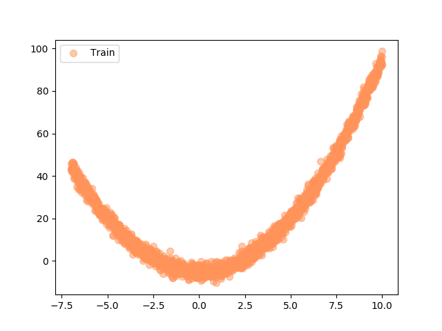
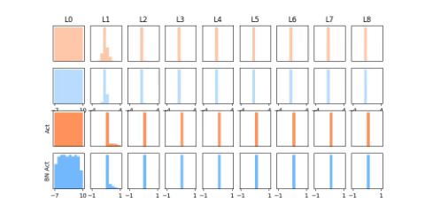
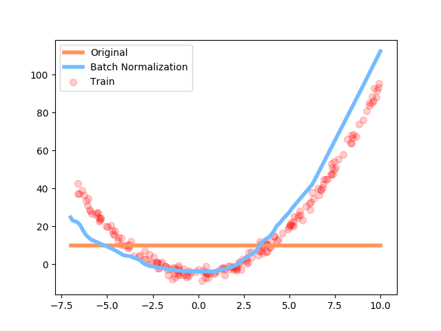
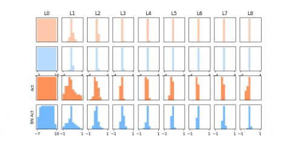
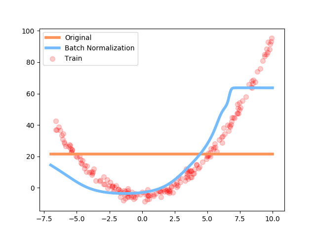

# Practice 15 - Batch Normalization in TensorFlow

This practice is refer to the following resources credited to [Morvan](https://github.com/MorvanZhou).
* [莫烦PYTHON - TensorFlow: 什么是批标准化 (Batch Normalization)](https://morvanzhou.github.io/tutorials/machine-learning/tensorflow/5-13-A-batch-normalization/)
* [莫烦PYTHON - TensorFlow: Batch Normalization 批标准化](https://morvanzhou.github.io/tutorials/machine-learning/tensorflow/5-13-BN/)

---
## Execution

1. Run `main.py` with a argument
    ```bash
    # Make sure your current directory is in this folder
    # Train with "ReLU" as the activation function
    $ python3 main.py relu
    # Train with "tanh" as the activation function
    $ python3 main.py tanh
    ```
2. If succeed, you will get the following result
    ```bash
    # Train with "ReLU" as the activation function
    [INFO] Using ReLU as activation function
    # Train with "tanh" as the activation function
    [INFO] Using tanh as activation function
    ```
3. Besides, you will see the following figures
    * Training with `tf.nn.relu` as the activation function
        * Input data
            
        * Histogram
            
        * Loss rate
            
    * Training with `tf.nn.tanh` as the activation function
        * Input data
            
        * Histogram
            
        * Loss rate
            

---
## References

* [TensorFlow Official - Tutorial](https://www.tensorflow.org/tutorials/)
* [GitHub - tensorFlow/tensorflow](https://github.com/tensorflow/tensorflow)
* [莫烦PYTHON - TensorFlow](https://morvanzhou.github.io/tutorials/machine-learning/tensorflow)
* [Batch Normalization: Accelerating Deep Network Training by Reducing Internal Covariate Shift](https://arxiv.org/abs/1502.03167)