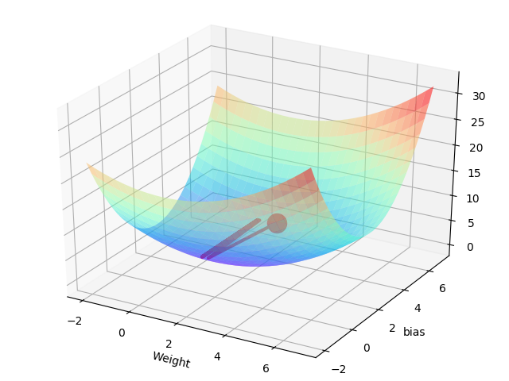

# Practice 16 - Visualize Gradient Descent in TensorFlow

This practice is refer to the following resources credited to [Morvan](https://github.com/MorvanZhou).
* [莫烦PYTHON - 有趣的机器学习: 神经网络 梯度下降](https://morvanzhou.github.io/tutorials/machine-learning/ML-intro/2-8-gradient-descent/)
* [莫烦PYTHON - TensorFlow: 用 Tensorflow 可视化梯度下降](https://morvanzhou.github.io/tutorials/machine-learning/tensorflow/5-15-tf-gradient-descent/)

---
## Execution

1. Run `main.py` with a argument
    ```bash
    # Make sure your current directory is in this folder
    # Using linear function as target and training function and learning rate 0.1
    $ python3 main.py 1 0.1

    # Using non-linear as target and training function and learning rate 0.1
    $ python3 main.py 2 0.1

    # Using sin/cos as target and training function and learning rate 0.1
    % python3 main.py 3 0.1
    ```
2. If succeed, you will get the following result
    ```bash
    # Training with "ReLU" as the activation function
    [INFO] Using linear function as target and training function
    [INFO] Using 0.1 learning rate
    Weight =  1.2083511 bias =  2.5011578

    # Training with "tanh" as the activation function
    [INFO] Using non-linear function as target and training function
    [INFO] Using 0.1 learning rate
    Weight =  1.2017697 bias =  2.485243

    # Using sin/cos function as target and training function
    [INFO] Using sin/cos function as target and training function
    [INFO] Using 0.1 learning rate
    Weight =  1.2080404 bias =  2.4960968
    ```
3. Besides, you will see the following figures
    | Function | Learning rate = 0.1 | Learning rate = 1.0 |
    |---|---|---|
    | Linear |   |   |
    | Non-linear |   |   |
    | sin/cos |   |   |

---
## References

* [TensorFlow Official - Tutorial](https://www.tensorflow.org/tutorials/)
* [GitHub - tensorFlow/tensorflow](https://github.com/tensorflow/tensorflow)
* [莫烦PYTHON - TensorFlow](https://morvanzhou.github.io/tutorials/machine-learning/tensorflow)
* [Batch Normalization: Accelerating Deep Network Training by Reducing Internal Covariate Shift](https://arxiv.org/abs/1502.03167)