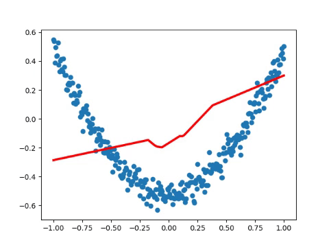

# Practice 6 - Visualize in TensorFlow

This practice is refer to the following resources credited to [Morvan](https://github.com/MorvanZhou).
* [莫烦PYTHON - TensorFlow: 例子3 结果可视化](https://morvanzhou.github.io/tutorials/machine-learning/tensorflow/3-3-visualize-result/)
* [莫烦PYTHON - TensorFlow: 加速神经网络训练 (Speed Up Training)](https://morvanzhou.github.io/tutorials/machine-learning/tensorflow/3-4-A-speed-up-learning/)
* [莫烦PYTHON - TensorFlow: 优化器 optimizer](https://morvanzhou.github.io/tutorials/machine-learning/tensorflow/3-4-optimizer/)

---
## Execution

1. Run `main.py`
    ```bash
    # Make sure your current directory is in this folder
    $ python3 main.py
    ```
2. If succeed, you will get the following result (the result is not unique)
    

---
## References

* [TensorFlow Official - Tutorial](https://www.tensorflow.org/tutorials/)
* [GitHub - tensorFlow/tensorflow](https://github.com/tensorflow/tensorflow)
* [莫烦PYTHON - TensorFlow](https://morvanzhou.github.io/tutorials/machine-learning/tensorflow)