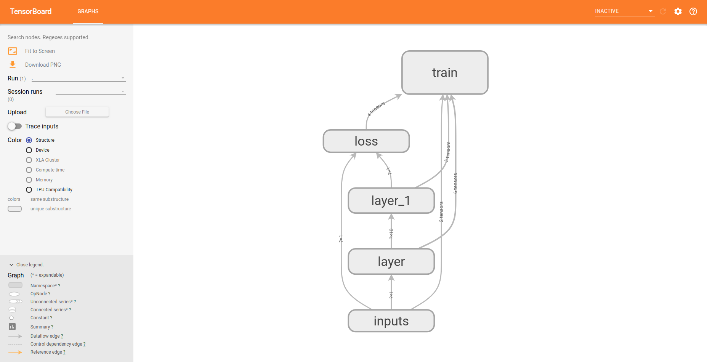

# Practice 7 - Using TensorBoard 1

This practice is refer to [莫烦PYTHON - TensorFlow: Tensorboard 可视化好帮手 1](https://morvanzhou.github.io/tutorials/machine-learning/tensorflow/4-1-tensorboard1/). Credits to [Morvan](https://github.com/MorvanZhou).

---
## Execution

1. Run `main.py`
    ```bash
    # Make sure your current directory is in this folder
    $ python3 main.py
    ```
2. If succeed, you will get the following result (the result is not unique)
    ```bash
    # Make sure your current directory is in this folder
    $ ls ./logs/
    events.out.tfevents.1553870885.yungshenglu
    ```
3. Run the log with TensorBoard
    ```bash
    $ tensorboard --logdir='./logs/'
    TensorBoard 1.13.0 at http://yungshenglu:6006 (Press CTRL+C to quit)
    ```
4. Open the browser and navigate to the website show in your terminal (`http://0.0.0.0:6006`)
    

---
## References

* [TensorFlow Official - Tutorial](https://www.tensorflow.org/tutorials/)
* [GitHub - tensorFlow/tensorflow](https://github.com/tensorflow/tensorflow)
* [莫烦PYTHON - TensorFlow](https://morvanzhou.github.io/tutorials/machine-learning/tensorflow)